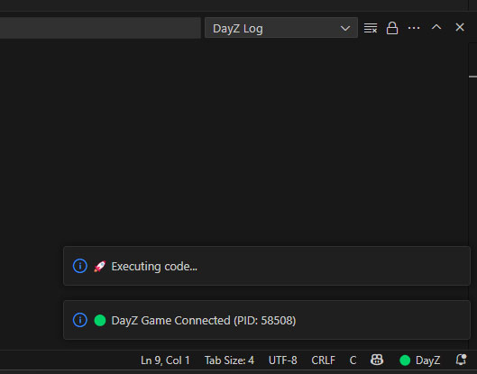
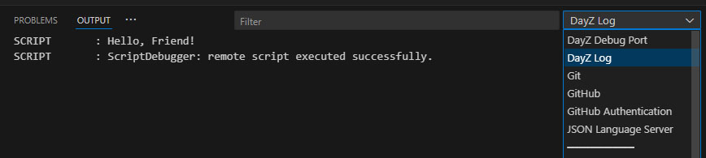
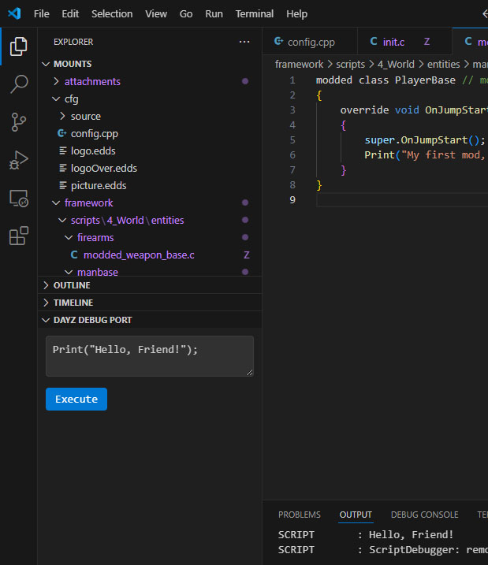
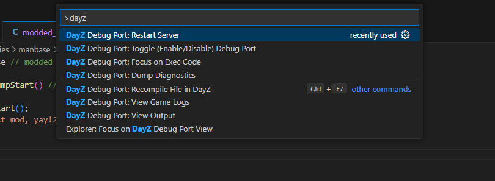
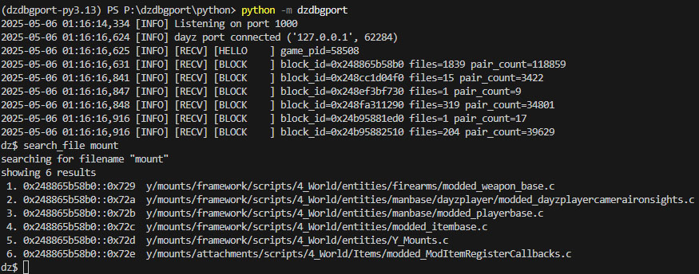

# DayZ Debug Port

DayZ Debug Port is an unofficial project for DayZ modders to enable debugging outside the Workbench app that ships with DayZ tools.

## 🧩 VSCode Extension

1. **Active Game Connection:** Maintains a connection to the game with realtime notifications for game connections, game exit and game crashes.

Also an output channel for the debug port logs themselves.

2. **Live Logs:** Output channel for logs from the connected game, streamed live.

3. **Code Exec**: Convenient window with script input to execute on the connected game.

4. **Recompile on Host**: Same old `Ctrl+F7` shortcut to recompile files loaded by the game. Loaded files are colored and makred with a **Z** badge beside their filename in the explorer and editor. Right click in the explorer also allows recompiling the file.

5. **And other commands**: Plugin is as versatile as possible.

## 📟 Python Package & Debug Console

The foundation for this extension is the Python package that can connect to the game and talk to it in the right protocol.

This package is bundled as an exe with the extension and talks to it using a websocket. The package also has a debug console that provides lower-level access to the functionality exposed via the VSCode extension.

